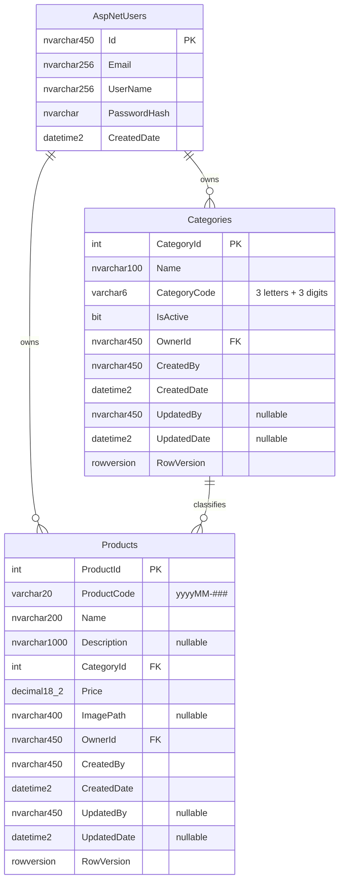

# Technical Documentation

Companion to the [README](../README.md), which covers setup and how to run the project.
This document covers the data model, the architecture, and the reasoning behind the
decisions a reviewer is most likely to ask about.

---

## 1. Entity Relationship Diagram



### Indexes and constraints

| Table | Index | Type | Why |
| --- | --- | --- | --- |
| Categories | `(OwnerId, CategoryCode)` | Unique | Enforces the uniqueness rule at the database, not just in code |
| Categories | `(OwnerId)` | Non-unique | Supports the ownership query filter |
| Products | `(OwnerId, ProductCode)` | Unique | Makes duplicate product codes impossible under concurrency |
| Products | `(CategoryId)` | Non-unique | Supports the category filter and the FK |

`Products.CategoryId → Categories.CategoryId` uses `ON DELETE RESTRICT`, so a category
holding products cannot be removed and orphan its rows.

### Why `CategoryName` is a foreign key

The brief lists `CategoryName` as a field on Product. It is modelled as a foreign key to
`Categories` instead of a duplicated string, so renaming a category cannot leave stale
names on products. The category's name and code are projected onto the product DTOs, so
the API and the Excel export still present `CategoryName` exactly as specified.

---

## 2. Architecture

Four projects, with dependencies pointing inward only:

```
┌──────────────────────────────────────────────┐
│ PPECB.API            Controllers, JWT setup, │
│ (Presentation)       exception middleware    │
└───────────────────────┬──────────────────────┘
                        │ depends on
┌───────────────────────▼──────────────────────┐
│ PPECB.Infrastructure EF Core, repositories,  │
│ (Data access)        Identity, Excel, files  │
└───────────────────────┬──────────────────────┘
                        │ depends on
┌───────────────────────▼──────────────────────┐
│ PPECB.Application    Services, DTOs,         │
│ (Business logic)     contracts, validation   │
└───────────────────────┬──────────────────────┘
                        │ depends on
┌───────────────────────▼──────────────────────┐
│ PPECB.Domain         Entities, exceptions.   │
│ (Core)               No dependencies at all. │
└──────────────────────────────────────────────┘
```

The Application layer defines interfaces (`ICategoryRepository`, `IExcelService`,
`IFileStorageService`, `ICurrentUserService`, …) that Infrastructure implements. This is
the Dependency Inversion Principle in practice: business logic depends on abstractions,
so the EF Core, ClosedXML and file-system choices are all swappable, and the service
layer is unit-testable with fakes.

Each layer registers its own services via an `AddApplication()` / `AddInfrastructure()`
extension method, so `Program.cs` never has to know the internals of the layers below it.

---

## 3. Design patterns used

| Pattern | Where | Why |
| --- | --- | --- |
| **Repository** | `ICategoryRepository`, `IProductRepository` | Keeps EF Core out of the business logic and makes services testable |
| **Unit of Work** | `IUnitOfWork` | The service layer decides the transaction boundary — one save per use case |
| **Dependency Injection** | Throughout | Constructor injection everywhere; no service location or statics |
| **Strategy** | `IProductCodeGenerator` | Code-generation rule is isolated and independently testable |
| **Options** | `JwtOptions`, `FileStorageOptions` | Strongly-typed, validated configuration |
| **Middleware / Chain of responsibility** | `ExceptionHandlingMiddleware` | One place translates exceptions to HTTP responses |
| **DTO + mapper** | `EntityMappings` | Entities never cross the API boundary, so persistence details are not exposed |

Mapping is hand-written rather than using AutoMapper. With two entities, explicit
projections are clearer, have no startup cost, and fail at compile time rather than at
runtime when a property is renamed.

---

## 4. How the graded rules are implemented

### Category code — 3 letters + 3 numbers, unique

`CodeFormats.IsValidCategoryCode` holds the single regex `^[A-Za-z]{3}[0-9]{3}$`. It is
used by `CategoryService`, so the API, the UI and the tests all enforce the same rule.
Input is trimmed and upper-cased before storage, so `abc123` cannot slip past `ABC123`.
Uniqueness is checked in the service for a friendly message *and* enforced by a unique
index, so a race cannot create a duplicate.

Uniqueness is scoped per user. Global uniqueness would let one account's codes block
another's, which would leak the existence of other users' data.

### Product code — auto-generated `yyyyMM-###`

`ProductCodeGenerator` builds the `yyyyMM` prefix from the current UTC date, reads the
highest sequence already issued for that prefix, and adds one. The value is never
accepted from the client.

Read-then-write is not atomic, so the unique index on `(OwnerId, ProductCode)` is the
real guarantee. When a concurrent insert takes the code first, the `DbContext` translates
SQL Server error 2601/2627 into a `DuplicateKeyException` and `ProductService` retries
with the next number (up to five attempts).

Sequences past 999 grow to four digits rather than wrapping and colliding.

### Paging — 10 per page

`PagedResult<T>` carries the items plus total count and page metadata. Paging happens in
SQL via `Skip`/`Take`, not in memory. `PagingDefaults` normalises the inputs and caps the
page size at 100 so a caller cannot request an unbounded page.

### Per-user data isolation

Global query filters on the `DbContext`:

```csharp
builder.Entity<Category>().HasQueryFilter(c => c.OwnerId == CurrentOwnerId);
builder.Entity<Product>().HasQueryFilter(p => p.OwnerId == CurrentOwnerId);
```

`CurrentOwnerId` is a context property reading from `ICurrentUserService`, which resolves
the id from the validated JWT. Exposing it as a property (rather than capturing the
service inside the lambda) means EF treats it as a per-query parameter instead of baking
one user's id into the cached model.

Because the filter is central, no query can forget it. `RepositoryBase.GetByIdAsync` is
deliberately abstract rather than using `DbSet.FindAsync`, because `Find` can return an
entity already in the change tracker without re-applying the filter.

### Auditing

`ApplicationDbContext.SaveChangesAsync` stamps `CreatedBy`/`CreatedDate` on insert and
`UpdatedBy`/`UpdatedDate` on update, from the token. On update, `CreatedBy`, `CreatedDate`
and `OwnerId` are explicitly marked unmodified, so they are immutable after insert and a
client cannot rewrite history by sending them in a request body.

### Concurrency

Every entity carries a `rowversion`. Clients send back the value they loaded; the
repository sets it as the tracked entry's **original** value, because EF compares the
original — assigning the property alone would not trigger the check. A conflict surfaces
as `409 Conflict` with a message telling the user to reload.

---

## 5. Error handling

`ExceptionHandlingMiddleware` maps domain exceptions to status codes:

| Exception | Status | Body |
| --- | --- | --- |
| `ValidationException` | 400 | `ValidationProblemDetails` with per-field messages |
| `BusinessRuleException` | 400 | Problem document with a detail message |
| `NotFoundException` | 404 | Problem document |
| `ConcurrencyConflictException` | 409 | "Changed by someone else…" |
| `DuplicateKeyException` | 409 | "That value is already in use." |
| Anything else | 500 | Generic message in Production; full detail otherwise |

Controllers contain no `try`/`catch`, which keeps them thin and guarantees consistent
responses. The middleware runs first in the pipeline so it also catches failures raised
further down.

---

## 6. Testing

52 xUnit tests, run with `dotnet test`:

| Area | What is covered |
| --- | --- |
| `CodeFormatsTests` | Every accept/reject case for both code formats, including the brief's `ABC123` and `202105-023` examples |
| `CategoryServiceTests` | Format rejection, duplicate rejection, upper-casing, and that editing a category does not report its own code as a duplicate |
| `ProductCodeGeneratorTests` | First code of a month, continuing a sequence, rolling past 999, correct month prefix |
| `ProductServiceTests` | Code assignment, retry on collision, inactive/unowned category rejection, delete ordering, and all-or-nothing import |
| `OwnershipIsolationTests` | Runs against a real `DbContext` to prove one user cannot see or fetch another's rows, and that audit fields are stamped correctly |

The ownership tests use the EF in-memory provider so the actual query filters and audit
logic execute, rather than being mocked away.

---

## 7. Decisions worth noting

**Repository + Unit of Work over exposing `DbContext`.** It costs a little more code, but
keeps EF Core out of the Application layer and makes the service tests fast and
dependency-free.

**ClosedXML over EPPlus.** EPPlus moved to a commercial licence at version 5; ClosedXML is
MIT and its API is more readable than raw OpenXML.

**All-or-nothing Excel import.** A partial import leaves the user unsure what actually
landed. Validating every row first and reporting all failures together lets them fix the
file in one pass.

**Images on disk, path in the database.** Storing binaries in SQL Server bloats the
database and backups for no benefit at this scale. Filenames are GUIDs and content is
checked against known image signatures, so a client filename never becomes a path and a
renamed script cannot be stored.

**JWT over cookies.** The Angular client is served from a different origin to the API, so
bearer tokens avoid cross-site cookie and CSRF complications. The trade-off is that
logout is client-side only; a production system would add refresh tokens and server-side
revocation.

### Known limitations

- Tokens cannot be revoked before expiry (60 minutes). Refresh tokens are the usual next step.
- Category delete is not exposed. The brief asks only for view/add/edit, and `IsActive`
  serves as a soft delete; the repository has `HasProductsAsync` ready if it is added.
- Uploaded images are served from local disk, which does not survive a multi-server
  deployment. Blob storage would be the production choice.
- Excel import creates products only; it does not update existing ones.
